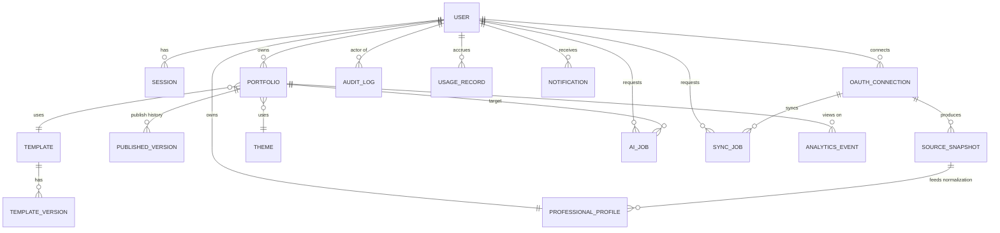
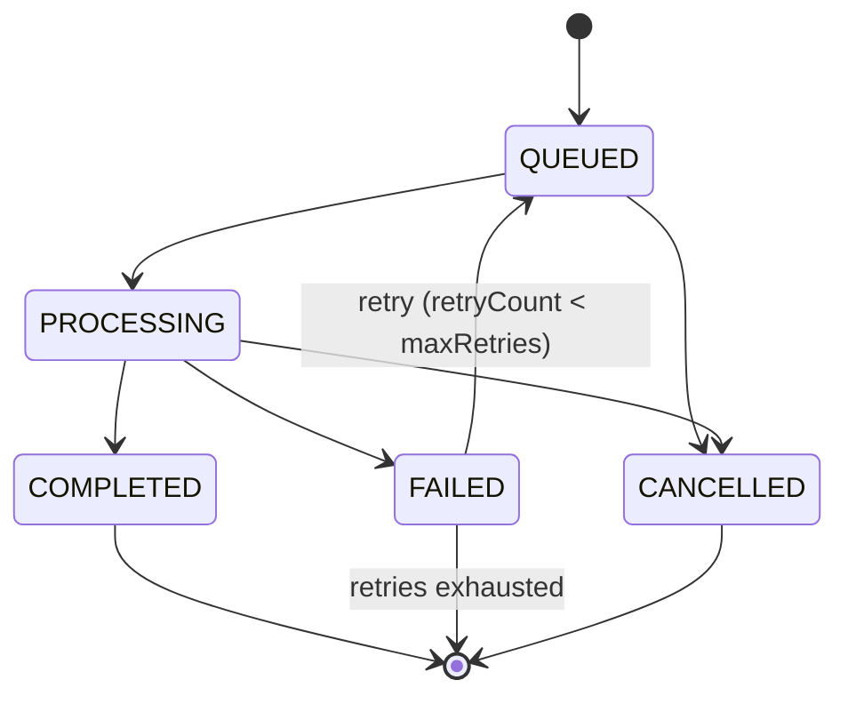
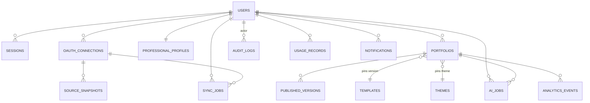

# STEP-09-DATABASE-DATA-MODEL-SPECIFICATION.md

**Project:** AI-Powered Portfolio Generator
**Step:** 9 — Database + Data Model + Multi-User Data Architecture
**Database Engine:** MongoDB
**Status:** Draft for review — no application code, no Mongoose schemas, no migrations

---

## 1. Executive Summary

This document defines the complete MongoDB data architecture for the platform: authentication, OAuth source connections, raw and normalized professional data, PortfolioData, portfolio configuration, templates/versions/themes, drafts, published versions, AI jobs, sync jobs, audit logs, usage, notifications, and admin observability.

The design follows document-database principles rather than relational translation: data that is always read and written together is embedded; data that is independently sized, independently queried, shared across owners, or grows unboundedly is referenced. Every user-owned collection carries an explicit `userId` (or resolves ownership through a parent it belongs to), and every query pattern in this spec assumes the backend injects `userId` from the authenticated session — never from client input.

Core guarantees this architecture is built to preserve:

- A user can never read or write another user's private data.
- A failed sync, AI job, or publish can never destroy previously valid data.
- Public portfolio reads never touch private collections (OAuth, raw snapshots, drafts, AI history).
- Template/theme version upgrades never silently break an already-published portfolio.
- User overrides always survive re-synchronization from a source provider.

---

## 2. Database Principles

1. **Model for the read, not the write.** The most frequent, most latency-sensitive read (public portfolio by slug) drives the shape of `Portfolio` and `PublishedPortfolioVersion`.
2. **Embed 1:1 and 1:few data that is always co-read/co-written and bounded in size.** Example: `PortfolioData.hero`, `PortfolioConfiguration.sectionOrder`.
3. **Reference 1:many/unbounded, independently-lifecycled, or cross-owner data.** Example: `SourceSnapshot` documents (many, large, append-only) are referenced from `OAuthConnection`, not embedded in the user.
4. **Separate volatile/security-sensitive data from stable identity data.** `User` (auth) is separate from `ProfessionalProfile` (domain) and from `Session` (ephemeral).
5. **Snapshot, don't recompute, for anything that must render identically later.** `PublishedPortfolioVersion` stores a frozen copy of data + config + template version + theme, so template/theme edits never retroactively change a live public page.
6. **Prefer append-only + status field over in-place mutation for jobs and history.** Enables idempotency, auditability, and safe retries.
7. **Index for actual query patterns only** (Section 27) — no speculative indexes.
8. **TTL only for genuinely disposable data** (Section 35/36) — never on audit logs, published versions, or professional data.
9. **Multi-user isolation is a backend contract enforced on every query**, not a database feature — but the schema is designed so an isolation bug is easy to catch (every private collection has `userId` in its primary compound index).

---

## 3. Entity Inventory & Collection Decisions

| Candidate Entity | Decision | Rationale |
|---|---|---|
| User | Own collection `users` | Root identity, referenced everywhere |
| UserProfile | **Merged into `users.profile`** (embedded sub-document) | 1:1, small, always read with user |
| Session | Own collection `sessions` | High write/expire churn, TTL-managed, unrelated to user document size |
| OAuthConnection | Own collection `oauth_connections` | 1:many per user, holds sensitive token metadata, independent lifecycle (connect/disconnect/refresh) |
| SourceSnapshot | Own collection `source_snapshots` | Many per connection, large, append-only, needs independent retention/TTL |
| ProfessionalProfile | Own collection `professional_profiles` | 1:1 per user but large/nested; kept separate from `users` so auth reads stay cheap |
| Experience / Education / Skill / Project / Certification / Achievement | **Embedded arrays inside `professional_profiles`** | Always read together as "the profile"; bounded count per user (tens, not thousands); simplifies conflict/override logic co-located per field |
| Portfolio | Own collection `portfolios` | Root of the portfolio subsystem, referenced by slug |
| PortfolioData | **Embedded inside `portfolios.draftData`** and duplicated (frozen) inside `PublishedPortfolioVersion.dataSnapshot` | Always read/written with its owning draft or version; not independently queried |
| PortfolioConfiguration | **Embedded inside `portfolios.draftConfig`** and inside `PublishedPortfolioVersion.configSnapshot` | Same as above — 1:1 with a data snapshot |
| PortfolioDraft | **Modeled as fields on `portfolios`** (`draftData`, `draftConfig`, `draftVersion`, `draftUpdatedAt`) rather than a separate collection | A portfolio has exactly one live draft; splitting it into its own collection would add a join for every edit with no benefit |
| PublishedPortfolioVersion | Own collection `published_versions` | Many per portfolio (history), immutable once created, needs independent TTL/retention policy separate from the live portfolio doc |
| PortfolioRevision | **Not a separate collection** — history is served by `published_versions` (Section 18) | Avoids a third redundant "diff" concept; published versions already provide restorable snapshots |
| Template | Own collection `templates` | System-level, shared across all users, low write volume |
| TemplateVersion | **Embedded array inside `templates.versions`** | Small, bounded (tens of versions per template), always browsed together with the template |
| Theme | Own collection `themes` | System-level, referenced independently by templates and portfolios, can grow with user-created themes later |
| AIJob | Own collection `ai_jobs` | High volume, independent lifecycle, needs job-queue query patterns |
| SyncJob | Own collection `sync_jobs` | Same reasoning as AIJob |
| AuditLog | Own collection `audit_logs` | Append-only, compliance-grade, independent retention |
| UsageRecord | Own collection `usage_records` | High volume, aggregation target, billing-adjacent |
| Notification | Own collection `notifications` | Per-user inbox, independent read/unread lifecycle, TTL-eligible |
| AnalyticsEvent | Own collection `analytics_events` | Very high volume, eventual consistency, TTL/rollup-eligible |

**Total top-level collections:** `users`, `sessions`, `oauth_connections`, `source_snapshots`, `professional_profiles`, `portfolios`, `published_versions`, `templates`, `themes`, `ai_jobs`, `sync_jobs`, `audit_logs`, `usage_records`, `notifications`, `analytics_events` — **15 collections**.

---

## 4. Entity Relationship Diagram



**Logical flow:**
`User → OAuthConnection → SourceSnapshot → ProfessionalProfile → Portfolio (draft) → PublishedPortfolioVersion`, with `AIJob`/`SyncJob` as side-channel async operations against a `User`/`Portfolio`/`OAuthConnection`, and `AuditLog`/`UsageRecord`/`Notification`/`AnalyticsEvent` as cross-cutting observability streams.

System-level: `Template → TemplateVersion (embedded) ←→ Theme`, both referenced by `Portfolio` and frozen inside `PublishedPortfolioVersion`.

---

## 5. Collection Strategy (Summary Table)

| Collection | Purpose | Ownership | Embedded | Referenced | Lifecycle | Sensitivity | Expected Size | Primary Query |
|---|---|---|---|---|---|---|---|---|
| `users` | Auth + identity | Self | profile, preferences, security metadata | — | Long-lived, soft-delete then hard-delete | High (password hash) | 1 doc/user | by email, by id |
| `sessions` | Active login sessions | User | device metadata | userId | TTL-expired | Medium (token hash only) | Many/user, high churn | by sessionId, by userId |
| `oauth_connections` | Provider links | User | scopes, sync status | userId | Connect→sync→disconnect | High (token metadata) | 1-3/user | by userId+provider |
| `source_snapshots` | Raw provider payloads | User (via connection) | raw JSON | userId, connectionId | Append-only, TTL/retention capped | Medium-High | Many/user, largest volume | by connectionId+externalId, latest by hash |
| `professional_profiles` | Normalized profile | User | experience[], education[], skills[], projects[], certifications[], achievements[] | userId | Updated on sync/edit | Medium | 1 doc/user, moderately large | by userId |
| `portfolios` | Portfolio root + live draft | User | draftData, draftConfig | userId, templateId, themeId, publishedVersionId | Created→drafted→published→archived | Medium | Few/user | by slug, by userId |
| `published_versions` | Immutable published snapshots | Portfolio (via user) | full data+config snapshot | portfolioId, userId, templateVersionId, themeId | Immutable once created; superseded, never edited | Low-Medium (public data) | Many/portfolio (bounded by retention) | by portfolioId+status=active, by portfolioId+version |
| `templates` | Template registry | System | versions[] | — | Rarely changes | Low | Tens | by templateId, by status |
| `themes` | Theme registry | System | tokens | — | Rarely changes | Low | Tens–hundreds | by themeId |
| `ai_jobs` | AI generation jobs | User | usage/cost | userId, portfolioId | Queued→processing→terminal | Medium (may reference PII in input) | High volume | by status+createdAt, by userId |
| `sync_jobs` | Provider sync jobs | User | counts | userId, connectionId | Queued→processing→terminal | Low-Medium | High volume | by status+createdAt, by userId |
| `audit_logs` | Security/compliance trail | System (actor = user/admin) | metadata | actorId, resourceId | Append-only, long retention | Medium (no secrets) | Very high volume | by actorId, by resource, by time range |
| `usage_records` | Billing-adjacent metering | User | — | userId | Append-only, rollup-eligible | Low | Very high volume | by userId+period |
| `notifications` | In-app inbox | User | — | userId | Read→archived→TTL | Low | Medium/user | by userId+unread |
| `analytics_events` | Product/traffic analytics | Portfolio/anonymous | — | portfolioId (nullable) | TTL/rollup | Low (no PII beyond IP-derived) | Highest volume | by portfolioId+time |

---

## 6. User Model

**Collection:** `users`

```
users {
  _id
  email                 // unique, lowercased
  emailVerified: bool
  emailVerifiedAt

  auth: {
    passwordHash        // null if OAuth-only account
    passwordAlgo        // e.g. "argon2id" — never store plaintext
    passwordUpdatedAt
    mustResetPassword: bool
    failedLoginCount
    lockedUntil
  }

  role: enum ["USER", "ADMIN"]     // extensible for future roles
  status: enum ["ACTIVE", "SUSPENDED", "DEACTIVATED", "PENDING_DELETION"]

  profile: {              // UserProfile, embedded — 1:1, small, always co-read
    displayName
    avatarUrl
    timezone
    locale
  }

  preferences: {
    emailNotifications: bool
    productUpdates: bool
    theme: enum ["LIGHT","DARK","SYSTEM"]
  }

  security: {
    lastLoginAt
    lastLoginIp          // stored hashed/truncated, not raw where privacy requires
    mfaEnabled: bool
    mfaMethod
  }

  createdAt
  updatedAt
  deletedAt              // soft-delete marker, null unless PENDING_DELETION/DEACTIVATED
}
```

**Design notes:**
- Authentication fields (`auth.*`) are grouped and never returned by any API DTO — they exist only for backend comparison.
- `profile` (UserProfile) is embedded rather than a separate collection because it's always fetched with the user, is small, and has no independent lifecycle.
- Professional/domain data is deliberately **not** here — it lives in `professional_profiles`, keeping the auth document small and cheap to read on every request.
- `role` is a plain enum today; a future `roles: []` array or a separate `permissions` sub-document can be added without migration pain since it's additive.

---

## 7. Session Model

**Collection:** `sessions`

```
sessions {
  _id
  userId                 // indexed
  tokenHash               // hash of the session/refresh token, never the raw token
  createdAt
  expiresAt                // TTL index target
  revokedAt                 // null if active
  lastActivityAt
  device: {
    userAgent
    ipHash                  // hashed, not raw IP, to limit PII retention
    platform
  }
}
```

**Design notes:**
- Only a hash of the token is stored — a leaked database never yields usable session tokens.
- `expiresAt` drives a TTL index for automatic cleanup (Section 35).
- `revokedAt` supports explicit logout / "log out of all devices" without waiting for TTL.
- No password, no OAuth tokens, ever stored here.

---

## 8. OAuth Connection Model

**Collection:** `oauth_connections`

```
oauth_connections {
  _id
  userId                       // indexed
  provider: enum ["GITHUB","LINKEDIN"]
  providerAccountId             // external user id at the provider
  status: enum ["CONNECTED","EXPIRED","REVOKED","ERROR"]

  scopes: [string]

  credentials: {
    accessTokenEncrypted        // encrypted at rest (application-level envelope encryption), never plaintext
    refreshTokenEncrypted
    tokenType
    expiresAt
  }

  sync: {
    lastSyncAt
    lastSuccessfulSyncAt
    lastError
    lastErrorAt
  }

  createdAt
  updatedAt
  disconnectedAt
}
```

**Credential protection:**
- Tokens are stored **encrypted at the application layer** (envelope encryption with a KMS-managed key), not merely relying on disk-level encryption.
- `credentials` is never included in any API response DTO — API layers project it out explicitly.
- On disconnect, `credentials.*` fields are overwritten with nulls (Section 37) rather than merely flagging status, so a stale document can never leak a live token.
- Compound unique index on `(userId, provider)` prevents duplicate connections per provider per user (one active GitHub connection per user, for example) while still allowing a new document after a prior one is fully disconnected/deleted, depending on business rule (see Section 25).

---

## 9. Source Snapshot Model

**Collection:** `source_snapshots`

```
source_snapshots {
  _id
  userId                      // indexed, denormalized from connection for isolation
  connectionId                 // indexed
  provider
  externalRecordId              // e.g. GitHub repo id, LinkedIn record id
  recordType: enum ["PROFILE","REPO","POSITION","EDUCATION","CERTIFICATION", ...]

  payload: { ... }              // raw provider JSON, size-bounded (Section 41)
  payloadHash                   // hash of payload for change detection

  version                       // increments when payload changes
  retrievedAt

  retention: {
    expiresAt                    // optional TTL for old snapshot versions
  }
}
```

**What is NOT stored:**
- Provider OAuth tokens or secrets (those live only in `oauth_connections.credentials`).
- Third-party private data not needed for normalization (e.g., a GitHub user's private email if not explicitly authorized, other users' data returned incidentally in list responses).
- Full webhook payloads unrelated to the entities the platform models.

**Change detection:** `payloadHash` lets a sync job skip reprocessing unchanged records — only a hash mismatch triggers re-normalization, keeping `professional_profiles` updates cheap and idempotent.

**Retention:** only the latest N versions (or latest + last-known-good) per `(connectionId, externalRecordId)` are retained long-term; older versions are TTL-eligible (Section 35).

---

## 10. Normalized Professional Data Model

**Collection:** `professional_profiles` (1 document per user)

```
professional_profiles {
  _id
  userId                       // unique index — 1:1 with user

  identity: {
    fullName: <AttributedField>
    headline: <AttributedField>
    about: <AttributedField>
    avatarUrl: <AttributedField>
  }

  experience: [ <AttributedField-wrapped experience item> ]
  education: [ <AttributedField-wrapped education item> ]
  skills: [ <AttributedField-wrapped skill item> ]
  projects: [ <AttributedField-wrapped project item> ]
  certifications: [ <AttributedField-wrapped certification item> ]
  achievements: [ <AttributedField-wrapped achievement item> ]

  socialLinks: [ { platform, url, source, userOverride } ]
  contact: { email, phone, website, source, userOverride }

  updatedAt
  lastSyncedAt
}
```

Arrays (`experience`, `education`, etc.) are **embedded**, not referenced, because:
- They are always read as part of "the user's profile" (no independent query pattern needs "all experiences across all users").
- Per-user counts are bounded (tens of items, not thousands).
- Embedding keeps conflict resolution and override logic co-located per field, avoiding N+1 lookups when rendering a profile or generating a portfolio.

---

## 11. Source Attribution & Conflict Resolution

Every normalized field that can originate from multiple sources uses a shared **AttributedField** shape:

```
AttributedField<T> {
  value: T                        // the winning/effective value
  sources: [
    {
      provider: enum ["GITHUB","LINKEDIN","MANUAL"]
      value: T
      snapshotId                   // reference to source_snapshots
      importedAt
      confidence: number(0-1)
    }
  ]
  userOverride: {
    active: bool
    value: T
    setAt
  }
  reviewStatus: enum ["AUTO_RESOLVED","NEEDS_REVIEW","USER_CONFIRMED"]
  updatedAt
}
```

**Resolution rule (deterministic, applied on every sync):**
1. If `userOverride.active` is true → `value = userOverride.value`, `reviewStatus = USER_CONFIRMED`. A sync **never** overwrites this.
2. Else if all sources agree → `value` = the agreed value, `reviewStatus = AUTO_RESOLVED`.
3. Else → pick the highest-confidence source as `value`, set `reviewStatus = NEEDS_REVIEW`, surface the conflict in the UI (e.g., GitHub "Prince" vs LinkedIn "Prince Asodariya").

This guarantees the invariant from Section 11 of the project context: **user edits survive synchronization**, because sync logic only ever appends/updates `sources[]` and re-runs the resolution rule — it never touches `userOverride`.

---

## 12. Deduplication Model

Applied primarily to `experience`, `projects`, and `skills`, where the same real-world entity can arrive from multiple providers or manual entry.

```
dedup metadata (embedded per array item) {
  externalIds: [ { provider, id } ]     // e.g. GitHub repo id, LinkedIn position id
  canonicalId                            // stable internal id once merged
  matchKey                               // normalized string used for fuzzy matching (e.g. lowercased company+title, or repo slug)
  matchHash                              // hash of matchKey for fast equality lookups
  mergeState: enum ["UNMERGED","MERGED","MANUALLY_SPLIT"]
  mergedFrom: [ externalId... ]          // audit trail of what was combined
}
```

**Process:** on ingestion, a new source record's `matchHash` is compared against existing items' `matchHash` for the same user. An exact match merges into the existing item (adds to `externalIds`/`sources`); a fuzzy near-match (e.g., Levenshtein-close company names) is flagged `NEEDS_REVIEW` rather than auto-merged, to avoid incorrectly combining two distinct records.

---

## 13. Portfolio Model

**Collection:** `portfolios`

```
portfolios {
  _id
  userId                        // indexed, owner

  name
  slug                            // unique, indexed — public-facing identifier
  status: enum ["DRAFT_ONLY","PUBLISHED","UNPUBLISHED","ARCHIVED"]

  templateId
  templateVersionId
  themeId

  draftData: <PortfolioData>       // embedded, see Section 14
  draftConfig: <PortfolioConfiguration> // embedded, see Section 15
  draftVersion: number              // optimistic lock / autosave counter

  publishedVersionId               // reference to active published_versions doc, null if never published
  publishedAt

  seo: {
    title
    description
    ogImageUrl
  }

  visibility: enum ["PUBLIC","UNLISTED","PRIVATE"]

  createdAt
  updatedAt
  deletedAt                        // soft delete
}
```

The document does **not** unnecessarily restrict to one-portfolio-per-user: `userId` is not unique, so a user may own multiple `portfolios` documents, satisfying the "do not restrict unless required" instruction while still allowing a product rule of "1 active portfolio" to be enforced at the application layer if desired.

---

## 14. PortfolioData (Embedded)

```
PortfolioData {
  hero: { name, headline, tagline, avatarUrl }
  about: { summary, longBio }
  experience: [ { title, company, startDate, endDate, description, highlights[] } ]
  education: [ { school, degree, field, startDate, endDate } ]
  projects: [ { title, description, url, repoUrl, imageUrl, tags[] } ]
  skills: [ { name, category, level } ]
  certifications: [ { name, issuer, issueDate, url } ]
  achievements: [ { title, description, date } ]
  github: { username, stats: { repos, stars, followers }, pinnedRepos[] }
  social: [ { platform, url } ]
  contact: { email, phone, website }
  customSections: [ { id, title, type, content } ]
}
```

**Why embedded:** `PortfolioData` is always read and written as a single unit — a portfolio editor loads/saves the whole object, and a published version freezes the whole object. It is bounded in size (Section 41 sets a practical ceiling), has no independent query pattern (no one queries "all experience items across all portfolios"), and embedding avoids join overhead on the hottest read path (Section 29, public portfolio render).

Note: `PortfolioData` is intentionally **decoupled from `ProfessionalProfile`** — it is generated from the profile (optionally via AI) but then becomes independently editable, so profile re-sync never silently mutates a portfolio the user has customized.

---

## 15. PortfolioConfiguration (Embedded)

```
PortfolioConfiguration {
  templateId
  templateVersionId
  themeId
  sectionVisibility: { hero: bool, about: bool, experience: bool, ... }
  sectionOrder: [string]              // ordered list of section keys
  featuredItems: { projectIds: [], skillIds: [] }
  templateSpecificConfig: { ... }      // free-form, validated against Template.configurationSchema
  seo: { title, description }
  publicVisibility: enum ["PUBLIC","UNLISTED","PRIVATE"]
}
```

Embedded alongside `PortfolioData` inside both the live draft (`portfolios.draftConfig`) and each `published_versions.configSnapshot`, since configuration and data are always published together as one atomic unit.

---

## 16. Draft Model

Drafts are modeled as fields directly on `portfolios` rather than a separate collection (Section 3 rationale). This guarantees the required invariant **draft ≠ published** by construction: `draftData`/`draftConfig` are mutable working fields, while `PublishedPortfolioVersion` documents are immutable once created.

```
Draft-related fields on portfolios:
  draftData
  draftConfig
  draftVersion        // integer, incremented on every save — optimistic lock
  draftUpdatedAt
  draftUpdatedBy       // userId (normally = owner, but allows future collaborators)
```

- **Draft creation:** happens implicitly when `portfolios` is created; there is always exactly one live draft per portfolio.
- **Draft updates:** every save does `findOneAndUpdate({ _id, draftVersion: expectedVersion }, { $set: {...}, $inc: { draftVersion: 1 } })` — a version mismatch means a concurrent edit occurred (Section 26).
- **Autosave:** the editor debounces client-side and issues the same versioned update; no separate autosave collection is needed since it's the same optimistic-lock write path.
- **Recovery:** because `draftData`/`draftConfig` are never deleted on publish (publish only *copies* them into a new `published_versions` doc), an accidental bad edit can be recovered by re-copying the last published version's snapshot back into the draft fields — an explicit "revert draft to published" action.

---

## 17. Published Version Model

**Collection:** `published_versions`

```
published_versions {
  _id
  portfolioId                 // indexed
  userId                        // denormalized for isolation checks
  version: number                // monotonically increasing per portfolio

  dataSnapshot: <PortfolioData>       // frozen copy at publish time
  configSnapshot: <PortfolioConfiguration>

  templateVersionId               // frozen — future template edits don't affect this version
  themeId
  themeTokensSnapshot               // frozen copy of theme tokens actually used

  publishedAt
  publishedBy                       // userId (owner today; supports future collaborators)
  status: enum ["ACTIVE","SUPERSEDED","ROLLED_BACK"]
}
```

**Immutability:** once created, a `published_versions` document is never mutated except for its `status` field (`ACTIVE → SUPERSEDED` when a newer version is published, or `→ ROLLED_BACK` if explicitly reverted to). This guarantees a failed *next* publish never corrupts the currently-live version — the new version is written first, and only on success does `portfolios.publishedVersionId` get atomically repointed and the old version's status flipped to `SUPERSEDED` (Section 38 covers the transaction boundary).

**Freezing template/theme:** `templateVersionId` and `themeTokensSnapshot` are copied in, not referenced live, so editing a template's active version or a theme's tokens later never retroactively changes how an already-published portfolio renders (Section 20's compatibility guarantee).

---

## 18. Revision / History Model

**Approach chosen: full snapshots, not deltas — implemented via the `published_versions` collection itself (no separate `PortfolioRevision` collection).**

**Why full snapshots over deltas:**
- Rendering a historical or rolled-back version must be O(1) — a delta chain would require replaying N diffs, adding latency and a class of bugs (corrupt/missing intermediate diff) that full snapshots simply cannot have.
- Publish events are infrequent relative to draft autosaves (autosaves don't create history entries — only explicit publish actions do), so the growth rate is naturally bounded and full snapshots are cheap enough.
- Rollback becomes a trivial "point `publishedVersionId` at an older `published_versions._id` and mark it ACTIVE" operation with no reconstruction logic.

**Database-size mitigation:** retention policy (Section 35) caps the number of retained `published_versions` per portfolio (e.g., last 20, or last 90 days, configurable), deleting the oldest `SUPERSEDED` versions beyond that — the current `ACTIVE` version and the immediately-previous one are always exempt from cleanup so rollback-by-one is always available.

---

## 19. Template Model

**Collection:** `templates`

```
templates {
  _id
  name
  description
  status: enum ["ACTIVE","DEPRECATED","ARCHIVED"]
  currentVersionId              // points into versions[]

  versions: [ <TemplateVersion> ]   // embedded, see Section 20

  supportedSections: [string]
  previewImageUrl
  configurationSchema: { ... }       // JSON-schema-like description used to validate templateSpecificConfig

  createdAt
  updatedAt
}
```

System-level, shared, low write-volume — a single collection with embedded versions is sufficient; no per-user documents.

---

## 20. Template Version Model (Embedded)

```
TemplateVersion {
  _id                     // stable id referenced by portfolios/published_versions
  version: string          // semver-like, e.g. "2.1.0"
  status: enum ["DRAFT","BETA","ACTIVE","DEPRECATED","ARCHIVED"]
  releaseNotes
  rendererRef               // pointer to the actual rendering implementation/component set
  configurationSchema
  createdAt
}
```

**Compatibility guarantee:** `portfolios.templateVersionId` and every `published_versions.templateVersionId` pin an exact version id. A template's `currentVersionId` can advance to a new `ACTIVE` version without touching any existing portfolio — portfolios only move to a newer version when the user explicitly re-selects/updates it. `DEPRECATED` versions remain fully renderable (just hidden from "choose a template" UI); `ARCHIVED` versions are only reachable by portfolios still pinned to them and are never deleted while any portfolio/published version still references them (enforced at the application layer before archival).

---

## 21. Theme Model

**Collection:** `themes`

```
themes {
  _id
  name
  version
  status: enum ["ACTIVE","DEPRECATED","ARCHIVED"]
  tokens: { colors: {...}, typography: {...}, spacing: {...} }
  createdAt
  updatedAt
}
```

Same freezing principle as templates: `published_versions.themeTokensSnapshot` captures the tokens at publish time, so live theme edits (e.g., a design-system color tweak) don't retroactively alter already-published pages unless the user republishes.

---

## 22. AI Job Model

**Collection:** `ai_jobs`

```
ai_jobs {
  _id
  idempotencyKey                // client-supplied or derived, unique per (userId, operation, inputHash)
  userId                          // indexed
  portfolioId                      // indexed, nullable (some ops precede portfolio creation)

  operation: enum ["GENERATE_PORTFOLIO_DATA","REWRITE_SECTION","SUGGEST_HEADLINE", ...]
  status: enum ["QUEUED","PROCESSING","COMPLETED","FAILED","CANCELLED"]

  provider                         // e.g. "anthropic"
  model                             // e.g. "claude-..."

  inputRef: { snapshotId | profileFieldPath | rawInputHash }
  outputRef: { professionalProfileFieldPath | portfolioDataFieldPath | storedResultId }

  retryCount
  maxRetries
  error: { code, message, occurredAt }

  usage: { inputTokens, outputTokens }
  cost: { amount, currency }

  queuedAt
  startedAt
  completedAt
  durationMs
}
```

Owned by `userId`; `portfolioId` scopes it further when applicable. `idempotencyKey` prevents duplicate generation from retried client requests (Section 25).

---

## 23. Sync Job Model

**Collection:** `sync_jobs`

```
sync_jobs {
  _id
  idempotencyKey
  userId                     // indexed
  connectionId                 // indexed
  provider

  jobType: enum ["FULL_SYNC","INCREMENTAL_SYNC","WEBHOOK_TRIGGERED"]
  status: enum ["QUEUED","PROCESSING","COMPLETED","FAILED","CANCELLED"]

  progress: { current, total }
  counts: { fetched, created, updated, deleted, skipped, conflicted }

  error: { code, message, occurredAt }
  retryCount
  maxRetries

  queuedAt
  startedAt
  completedAt
  durationMs
}
```

---

## 24. Job State Machines

**AI Job:**



**Sync Job:** identical shape/transitions — `QUEUED → PROCESSING → {COMPLETED | FAILED}`, with `FAILED → QUEUED` retry (bounded by `maxRetries`) and `CANCELLED` reachable from `QUEUED`/`PROCESSING`. A `FAILED` sync job never mutates `professional_profiles` beyond what already committed before the failure — writes are per-record and idempotent (Section 25), so a partial sync is safe to resume, not roll back.

---

## 25. Idempotency

| Scenario | Mechanism |
|---|---|
| Duplicate OAuth callback | Unique index on `(userId, provider)` in `oauth_connections`; callback handler upserts rather than inserts |
| Duplicate sync trigger (double-click, webhook replay) | `sync_jobs.idempotencyKey` unique index — second request with same key returns the existing job instead of creating a new one |
| Duplicate AI generation request | `ai_jobs.idempotencyKey` unique index, derived from `(userId, operation, inputHash)` |
| Duplicate publish request | `portfolios.draftVersion` optimistic lock (Section 26) — a publish reads the current draft version and the publish write is conditioned on it; a concurrent duplicate publish either no-ops or creates version N+1 cleanly, never two documents claiming the same `version` number (enforced via unique index on `(portfolioId, version)` in `published_versions`) |
| Sync writing the same source record twice | `source_snapshots` unique index on `(connectionId, externalRecordId, version)` combined with `payloadHash` comparison — unchanged payload is a no-op |

---

## 26. Concurrency Control

- **Optimistic locking on drafts:** every draft save is `findOneAndUpdate({ _id: portfolioId, draftVersion: expectedVersion }, { $set: { draftData, draftConfig, draftUpdatedAt: now }, $inc: { draftVersion: 1 } })`. If zero documents match, the client is told to refresh (its view is stale) — this is how "two browser tabs editing the same portfolio" is resolved without last-write-wins data loss.
- **Publish concurrency:** publish acquires the current `draftVersion`, writes a new `published_versions` document with `version = lastPublishedVersion + 1` (guarded by the unique compound index below), then atomically updates `portfolios.publishedVersionId`/`publishedAt`/`status` in the same transaction (Section 38). Two simultaneous publish clicks race on the unique index; the loser's insert fails and it retries against the now-current state, so publishing is never lost, just resolved deterministically.
- **Atomic counters:** `sync_jobs.counts.*` and `ai_jobs.retryCount` are updated with `$inc`, never read-modify-write in application code, to avoid lost updates under concurrent job workers.
- **Unique index example:** `published_versions` has a unique compound index on `(portfolioId, version)` — this is the concrete mechanism preventing two concurrent publishes from both claiming "version 5."

---

## 27. Index Strategy

| Collection | Index | Type | Query it optimizes | Why |
|---|---|---|---|---|
| `users` | `{ email: 1 }` | Unique | Login lookup by email | Email is the login identifier |
| `sessions` | `{ userId: 1, revokedAt: 1 }` | Compound | "active sessions for user" (logout-all) | Scoped session management |
| `sessions` | `{ expiresAt: 1 }` | TTL | Automatic cleanup | Sessions are disposable |
| `oauth_connections` | `{ userId: 1, provider: 1 }` | Unique compound | "user's GitHub connection" | Enforces one active connection per provider per user; primary lookup |
| `source_snapshots` | `{ connectionId: 1, externalRecordId: 1, version: -1 }` | Compound | Latest snapshot for a record | Core sync/idempotency lookup |
| `source_snapshots` | `{ userId: 1, retrievedAt: -1 }` | Compound | "user's recent raw data" (debug/admin) | Isolation-scoped listing |
| `professional_profiles` | `{ userId: 1 }` | Unique | 1:1 profile fetch | Enforces one profile per user |
| `portfolios` | `{ slug: 1 }` | Unique | Public portfolio lookup by slug | Hottest read path (Section 29) |
| `portfolios` | `{ userId: 1, status: 1 }` | Compound | "my portfolios" list | Owner dashboard |
| `published_versions` | `{ portfolioId: 1, version: 1 }` | Unique compound | Idempotent publish, version history listing | Prevents duplicate version numbers |
| `published_versions` | `{ portfolioId: 1, status: 1 }` | Compound, partial (`status: "ACTIVE"`) | "the active published version for a portfolio" | Public render path, tiny index since only one ACTIVE row per portfolio |
| `templates` | `{ status: 1 }` | Single | "active templates for selection UI" | Template picker |
| `ai_jobs` | `{ status: 1, queuedAt: 1 }` | Compound | Worker polling for pending jobs | Queue consumption pattern |
| `ai_jobs` | `{ userId: 1, createdAt: -1 }` | Compound | "my AI generation history" | User-facing history, isolation-scoped |
| `ai_jobs` | `{ idempotencyKey: 1 }` | Unique | Duplicate-request prevention | Section 25 |
| `sync_jobs` | `{ status: 1, queuedAt: 1 }` | Compound | Worker polling | Same pattern as AI jobs |
| `sync_jobs` | `{ userId: 1, createdAt: -1 }` | Compound | "my sync history" | Isolation-scoped |
| `sync_jobs` | `{ idempotencyKey: 1 }` | Unique | Duplicate-request prevention | Section 25 |
| `audit_logs` | `{ actorId: 1, timestamp: -1 }` | Compound | "actions by this user/admin" | Admin/security investigation |
| `audit_logs` | `{ resourceType: 1, resourceId: 1, timestamp: -1 }` | Compound | "history of this resource" | Debugging a specific portfolio/user |
| `usage_records` | `{ userId: 1, period: 1 }` | Compound | Billing period rollups | Future billing integration |
| `notifications` | `{ userId: 1, read: 1, createdAt: -1 }` | Compound | Inbox unread-first listing | Common UI pattern |
| `notifications` | `{ createdAt: 1 }` | TTL (partial, e.g. only where `archived: true`) | Cleanup of old read/archived notifications | Bounded inbox growth |
| `analytics_events` | `{ portfolioId: 1, timestamp: -1 }` | Compound | "views over time for this portfolio" | Owner analytics dashboard |
| `analytics_events` | `{ timestamp: 1 }` | TTL | Raw-event expiry after rollup | High volume, only aggregates retained long-term |

No indexes are created purely "in case" — every entry above ties to a named query pattern in Section 28.

---

## 28. Query Patterns

| Query | Collection(s) | Index used |
|---|---|---|
| Find user by email (login) | `users` | `{ email: 1 }` |
| Find OAuth connection by provider | `oauth_connections` | `{ userId: 1, provider: 1 }` |
| Get user's portfolios | `portfolios` | `{ userId: 1, status: 1 }` |
| Get public portfolio by slug | `portfolios` → `published_versions` | `{ slug: 1 }` then `{ portfolioId: 1, status: "ACTIVE" }` |
| Get active published version | `published_versions` | `{ portfolioId: 1, status: 1 }` (partial) |
| Get pending AI jobs (worker) | `ai_jobs` | `{ status: 1, queuedAt: 1 }` |
| Get failed sync jobs (admin/retry) | `sync_jobs` | `{ status: 1, queuedAt: 1 }` |
| Get admin analytics (aggregate) | `usage_records`, `analytics_events` | period/portfolio-scoped indexes, aggregation pipeline |
| Get audit events for a resource | `audit_logs` | `{ resourceType: 1, resourceId: 1, timestamp: -1 }` |

---

## 29. Public Read Path

**`GET /p/:slug` → render public portfolio**

```
1. portfolios.findOne({ slug, visibility: { $ne: "PRIVATE" }, status: "PUBLISHED" },
                       { projection: { publishedVersionId: 1, userId: 1 } })
2. published_versions.findOne({ _id: portfolio.publishedVersionId, status: "ACTIVE" },
                       { projection: { dataSnapshot: 1, configSnapshot: 1, templateVersionId: 1, themeTokensSnapshot: 1 } })
3. templates.findOne({ "versions._id": templateVersionId }, { projection: { "versions.$": 1, rendererRef: 1 } })
   -- or resolved via an in-memory/cached template-version registry, since templates are low-cardinality and rarely change
```

This path touches exactly **2-3 documents**, all via covered/indexed lookups, and never queries: `users` (beyond the implicit owner id, which isn't dereferenced), `oauth_connections`, `source_snapshots`, `professional_profiles`, `ai_jobs`, `sync_jobs`, `audit_logs`, or `portfolios.draftData/draftConfig`. A cache layer (CDN/edge or in-memory) can sit in front of step 2's result keyed by `slug`, since published versions are immutable once created.

---

## 30. Multi-User Isolation

Every user-owned collection carries `userId` (directly, or via `portfolioId → portfolios.userId` for one hop, e.g. `published_versions`). The backend rule, enforced in every service-layer query, is:

```
filter = { ...requestFilter, userId: session.authenticatedUserId }
```

**Never trusted as a source of ownership:**
- `req.body.userId`
- Any `userId`/`ownerId` embedded in a URL path or query string
- Any client-supplied "I am the owner" claim

**Enforcement pattern for nested resources** (e.g., "get this portfolio's draft"): the query is always `portfolios.findOne({ _id: portfolioId, userId: session.userId })` — a mismatched owner produces a 404 (not a 403, to avoid confirming the resource's existence to a non-owner) rather than ever falling through to a public-record path. Admin routes are a distinct code path (Section 31), never a bypass flag on the same endpoint.

---

## 31. Admin Access

Admin-observable data is read through **dedicated admin-only service methods and API routes**, never by relaxing the `userId` filter on normal user routes. This keeps "admin can see everything" and "users are isolated" as two separate, independently testable code paths instead of one path with a conditional.

Admin can query, read-only, across: `users` (excluding `auth.passwordHash`), `portfolios`, `ai_jobs`, `sync_jobs`, `audit_logs`, `usage_records`, aggregate `analytics_events`. Admin DTOs explicitly project out: `auth.passwordHash`, `oauth_connections.credentials.*`, `sessions.tokenHash`, and any `ai_jobs.inputRef`/`outputRef` payload that could contain the raw content of another user's professional data beyond what's needed for support/debugging (a redacted summary is preferred over raw content in admin listing views; full content requires a separate, audited "view PII" action that itself writes an `audit_logs` entry).

Admin-role checks happen at the route/middleware layer (`role === "ADMIN"`), independent of and prior to any resource-ownership check.

---

## 32. Audit Log Model

**Collection:** `audit_logs`

```
audit_logs {
  _id
  actorId                    // userId or adminId
  actorRole: enum ["USER","ADMIN","SYSTEM"]
  action: string               // e.g. "PORTFOLIO_PUBLISHED", "OAUTH_CONNECTED", "ACCOUNT_DELETED"
  resourceType: string          // e.g. "portfolio", "oauth_connection"
  resourceId
  metadata: { ... }             // action-specific, non-sensitive context (e.g. { slug, templateVersionId })
  ipHash                        // hashed, only where justified by security requirements
  deviceInfo                     // coarse (browser/platform), not full fingerprint
  timestamp
  result: enum ["SUCCESS","FAILURE"]
}
```

**Never logged:** password (hashed or plaintext), OAuth access/refresh tokens, session tokens, full raw AI prompts/outputs containing sensitive personal data (a reference/id is logged instead, per Section 31's redaction principle).

---

## 33. Usage Tracking Model

**Collection:** `usage_records`

```
usage_records {
  _id
  userId                     // indexed with period
  period: string               // e.g. "2026-08" for monthly rollups
  category: enum ["AI_GENERATION","AI_TOKENS","SYNC_OPERATION","STORAGE","PORTFOLIO_CREATED","PUBLIC_VIEW"]
  quantity: number
  unit: string                  // "count", "tokens", "bytes"
  recordedAt
  sourceRef: { jobId | portfolioId }   // traceability back to the originating event
}
```

Append-only, one record per metered event (or pre-aggregated per period, depending on volume tuning). Designed to be summed by `(userId, period, category)` — directly consumable by a future billing/plan-limits system without schema changes, since `category`/`quantity`/`unit` are already plan-agnostic.

---

## 34. Notification Model

**Collection:** `notifications`

```
notifications {
  _id
  userId                    // indexed
  type: enum ["SYNC_COMPLETED","SYNC_FAILED","AI_COMPLETED","AI_FAILED","PORTFOLIO_PUBLISHED","SECURITY_EVENT"]
  title
  body
  data: { ... }                // structured payload for deep-linking (e.g. { portfolioId })
  read: bool
  readAt
  archived: bool
  emailDispatched: bool          // whether an email-channel event was also emitted
  createdAt
}
```

`emailDispatched` decouples "in-app record exists" from "email was sent," letting an email worker consume `notifications` where `emailDispatched: false` without a separate outbox collection.

---

## 35. Data Retention

| Data | Retention Rule |
|---|---|
| Sessions | TTL on `expiresAt`; revoked sessions may be deleted immediately or left to TTL |
| Password reset tokens | Short-lived (e.g. 1 hour), TTL indexed, single-use (deleted/invalidated on use) |
| OAuth state (CSRF nonce during OAuth handshake) | Very short-lived (minutes), TTL indexed |
| Raw source snapshots | Latest N versions (e.g. 3) per record retained; older versions TTL-eligible after a configurable window (e.g. 90 days) |
| AI jobs / Sync jobs | Terminal (`COMPLETED`/`FAILED`/`CANCELLED`) jobs retained for a bounded window (e.g. 180 days) for support/debugging, then archived or deleted; **not** TTL'd immediately since recent job history is user-facing |
| Audit logs | Retained long-term (e.g. years, per compliance requirement) — **never TTL'd automatically** without an explicit policy decision |
| Analytics events (raw) | Short retention (e.g. 30-90 days) after which only pre-aggregated rollups persist |
| Usage records | Retained per billing/compliance requirement (e.g. 7 years for financial audit trails), not TTL'd |
| Published versions | Bounded per portfolio (Section 18) — oldest `SUPERSEDED` versions pruned beyond the cap; `ACTIVE` and the one immediately prior are always exempt |

---

## 36. Soft Delete vs Hard Delete

| Entity | Decision | Reasoning |
|---|---|---|
| User | **Mixed:** soft-delete (`status: DEACTIVATED/PENDING_DELETION`, `deletedAt`) immediately, hard-delete of PII after a grace period (e.g. 30 days, allowing account recovery) | Balances user recovery UX with eventual right-to-erasure compliance |
| Portfolio | Soft delete (`deletedAt`, `status: ARCHIVED`) | Users expect an "undo"/trash window; slug can be released after hard-delete |
| OAuth Connection | Hard delete of `credentials.*` immediately on disconnect; the connection document itself is soft-marked `disconnectedAt` for audit/history | Tokens are the sensitive part and must not linger even soft-deleted |
| Source Snapshot | Hard delete on retention expiry (Section 35) or on account deletion | Raw external data has no business value once stale/account is gone |
| Professional Profile | Hard delete on account deletion; soft delete not needed otherwise (it's always overwritten, not "deleted" in normal use) | No independent lifecycle outside the user's |
| Template / Theme | Soft delete (`status: ARCHIVED`) — never hard-deleted while referenced | Existing portfolios/published versions may still reference an old version |
| Session | Hard delete via TTL | Purely ephemeral, no historical value |
| Audit Log | Never deleted by the application (only by explicit, documented retention-policy jobs) | Compliance/security requirement |

---

## 37. Account Deletion

**Flow (idempotent, resumable — modeled as a dedicated internal job type, not a single synchronous request):**

```
1. Mark user: status = PENDING_DELETION, deletedAt = now
   → immediately: revoke all sessions (delete/expire in `sessions`)
2. Revoke OAuth connections
   → for each oauth_connections doc: null out credentials.*, status = REVOKED, disconnectedAt = now
   → best-effort call provider's token-revocation endpoint
3. Delete source data
   → hard-delete all `source_snapshots` where userId = user._id
4. Delete professional data
   → hard-delete `professional_profiles` doc for user
5. Delete/archive portfolios
   → soft-delete all `portfolios` (status = ARCHIVED, deletedAt = now)
   → release slugs (mark reusable) after grace period
   → mark all their `published_versions` status transitions as needed so public URLs 410/404 immediately
     (public read path in Section 29 already filters on `status: "PUBLISHED"`, so unpublishing is immediate;
      hard-delete of published_versions documents happens after the grace period)
6. Delete AI/job data
   → ai_jobs, sync_jobs for this user: retained briefly for abuse/fraud investigation per policy, then hard-deleted;
     never block account deletion completion on this step (fire-and-forget cleanup job)
7. Handle audit/retention requirements
   → audit_logs entries referencing this user are NOT deleted (compliance) — actorId/resourceId remain,
     but any embedded PII in `metadata` is redacted at write-time in the first place (Section 32), so no
     retroactive scrubbing is required
8. After grace period (e.g. 30 days) with no recovery request:
   → hard-delete the `users` document itself (or scrub remaining PII fields and retain a minimal tombstone
     if legally required to prove deletion occurred)
```

Each step is independently idempotent (safe to re-run if the job crashes mid-way) and ownership-scoped (`userId` filter), so a retried deletion job never touches another user's data.

---

## 38. Database Transactions

MongoDB multi-document transactions are used **only** where a single logical operation must be atomic across more than one collection and a partial failure would leave the system in an inconsistent, user-visible-bad state.

| Operation | Collections | Why a transaction is required | Failure behavior |
|---|---|---|---|
| **Publish portfolio** | `published_versions` (insert), `portfolios` (update `publishedVersionId`, `publishedAt`, `status`), prior `published_versions` doc (update `status: SUPERSEDED`) | The new version must exist *and* the portfolio must point to it *and* the old version must be marked superseded — a partial write (e.g., new version created but portfolio not repointed) would leave the public site serving stale/broken state | Abort → nothing changes; previous published version remains fully intact and serving |
| **Account deletion — step 2 (revoke all connections)** | Multiple `oauth_connections` documents for one user | Must not leave some connections revoked and others still holding live credentials mid-failure | Abort/retry per-connection is actually acceptable here since each connection is independently safe to revoke twice — **on reflection, this does NOT require a transaction**, it's naturally idempotent per-document (listed here to show the evaluation, not to prescribe one) |
| **Source merge (deduplication)** | Single `professional_profiles` document (array field updates) | Single-document atomic update via MongoDB's native document-level atomicity — **no transaction needed**, `$set`/`$push` on one document is already atomic |

**Explicitly NOT using transactions for:** sync job writes (per-record idempotent upserts tolerate partial completion and resume), AI job writes (single document), notification creation, audit log writes, usage record writes. Applying transactions there would add latency/lock contention with no correctness benefit.

---

## 39. Consistency Model

| Subsystem | Consistency | Explanation |
|---|---|---|
| Publishing (portfolio → published_versions) | **Strong** | Public correctness depends on it; uses a transaction (Section 38) |
| Draft editing | **Strong** (within a single document via optimistic locking) | Prevents silent lost updates between concurrent edits |
| OAuth connection state | **Strong** | Security-sensitive; must never show "connected" when credentials were actually revoked |
| Professional profile sync writes | **Strong per-field** (each AttributedField update is atomic), **eventually consistent across the whole sync job** | Individual field correctness matters immediately; the *entire* profile reflecting a full sync can lag until all records process — acceptable since the UI can show "sync in progress" |
| AI job / Sync job status | **Strong** (job documents are the source of truth for polling) | Users/UI poll status directly; must reflect true state |
| Usage records | **Eventually consistent** | Billing rollups tolerate a short aggregation lag |
| Analytics events | **Eventually consistent** | View counts/dashboards are inherently near-real-time, not transactional |
| Audit logs | **Strong write, eventually visible in aggregate reports** | The write itself must not be lost, but admin dashboards summarizing audit trends can lag |
| Notifications | **Eventually consistent** | A slightly-delayed "sync completed" toast has no correctness impact |

---

## 40. Scalability

| Scale | Considerations |
|---|---|
| **10,000 users** | Single MongoDB replica set comfortably handles all 15 collections; default indexes above are sufficient; no sharding needed |
| **100,000 users** | `source_snapshots` and `analytics_events` become the largest collections by document count — retention/TTL policy (Section 35) becomes operationally important, not optional; consider moving `analytics_events` to a time-series collection (MongoDB native timeseries type) for storage/index efficiency |
| **1,000,000 users** | Evaluate sharding on high-volume collections: `source_snapshots` (shard key candidate: `userId` — keeps a user's data co-located, matching the isolation model), `ai_jobs`/`sync_jobs` (shard key candidate: `userId` or a hashed key if job distribution across users is skewed), `analytics_events` (shard key: `portfolioId` or time-bucketed). `users`/`portfolios`/`professional_profiles` remain manageable unsharded far past 1M given their bounded per-document size, but read replicas should scale the public read path (Section 29) horizontally |

**Hot documents:** a viral portfolio's `portfolios` + `published_versions` documents become read-hot. Mitigated by: (a) published versions are immutable, so they're trivially cacheable at the edge/CDN keyed by slug; (b) the public read path (Section 29) is already minimal (2-3 docs); (c) read replicas absorb read load without touching the primary write path.

**Job volume:** `ai_jobs`/`sync_jobs` growth is bounded by active user count × usage frequency, not by total historical users — retention (Section 35) keeps the *queryable* working set small regardless of total platform age.

**Potential bottlenecks to monitor:** (1) `source_snapshots` unbounded growth without enforced retention; (2) `analytics_events` write throughput at high public traffic — mitigated by write-behind buffering/batching rather than a synchronous insert per page view; (3) single-document `professional_profiles` growing too large for a very active user with hundreds of imported repos (Section 41 addresses the cap).

---

## 41. Large Document Protection

MongoDB's 16MB document limit is not a practical concern at expected scale, but the following caps are enforced defensively:

| Data | Strategy |
|---|---|
| Raw source snapshots (`source_snapshots.payload`) | Store only the fields the platform actually normalizes from, not the full raw provider response where the provider returns large nested objects (e.g., a full GitHub repo tree); truncate/omit large binary or oversized text fields (long READMEs beyond N KB) |
| Portfolio history | Solved structurally — history lives in separate `published_versions` documents, not appended arrays on `portfolios`, so the live portfolio document never grows with history |
| AI input/output | `ai_jobs.inputRef`/`outputRef` store **references** (a snapshot id, a field path, or a pointer to object storage for large generated content), never the full raw AI payload inline, if it risks exceeding a reasonable per-document size (e.g. >100KB) |
| Large project/experience lists | `professional_profiles` arrays are expected to stay in the tens of items for realistic users; if an import (e.g., hundreds of GitHub repos) would push this too large, only top-N by relevance/activity are normalized into the array, with the rest remaining queryable in `source_snapshots` on demand |
| Analytics events | Kept minimal per-event (no large payloads) by design — this is precisely why they're a separate high-volume collection rather than embedded anywhere |

---

## 42. Backup and Recovery

- **Backup:** continuous incremental backups (MongoDB Atlas continuous backup or equivalent oplog-based backup) plus daily full snapshots, retained per a defined window (e.g., 35 days rolling, longer for monthly archives).
- **Restore:** documented restore-to-new-cluster procedure, tested — never restore in place onto a live production cluster without first restoring to a scratch environment and validating.
- **Point-in-time recovery:** enabled via oplog replay where the hosting provider supports it, allowing recovery to a specific timestamp (e.g., "moments before a bad migration ran").
- **Disaster recovery:** replica set members distributed across availability zones/regions per the hosting provider's topology; a full region loss triggers failover to a secondary region's replica, with defined RPO/RTO targets to be set alongside infra provisioning (Step outside this document's scope, but the data model itself has no design blocker to multi-region deployment).
- **Recovery testing:** periodic (e.g., quarterly) restore drills against a non-production environment, verifying both data integrity and that application-level assumptions (e.g., unique indexes, TTL indexes) are correctly rebuilt post-restore.

Note: MongoDB's own backup capability protects against infrastructure failure, not against application-level bugs (e.g., a bad migration deleting data) — recovery testing must specifically exercise that scenario, not just "did the backup restore."

---

## 43. Security Matrix

| Data | Sensitivity | Owner | Who Can Access | Storage Protection | API Exposure | Retention |
|---|---|---|---|---|---|---|
| Password hash | Critical | User | Backend auth service only | Hashed (argon2id), never plaintext | Never | Lifetime of account |
| Session tokens | High | User | Backend session service | Hashed, TTL | Never (only opaque cookie/header token client-side) | Short (TTL) |
| OAuth access/refresh tokens | Critical | User | Backend sync/integration service only | Envelope-encrypted at rest | Never | Until disconnect (then hard-deleted) |
| Raw source snapshots | Medium-High | User | Owning user (indirectly, via normalized data), backend sync service, admin (redacted) | Standard at-rest encryption | Never raw; normalized fields only | Bounded (Section 35) |
| Professional profile data | Medium | User | Owning user, backend, admin (support access, audited) | Standard at-rest encryption | Yes, via user's own authenticated endpoints | Lifetime of account |
| Portfolio draft data | Medium | User | Owning user only | Standard at-rest encryption | Yes, owner-only endpoints | Lifetime of portfolio |
| Published portfolio data | Low (intentionally public) | User | Anyone (if `visibility: PUBLIC`) | Standard | Yes, public endpoint by design | Per retention policy (Section 35/18) |
| AI job input/output | Medium | User | Owning user, backend, admin (redacted/audited) | Standard, references over inline payloads | Owner-only endpoints | Bounded (Section 35) |
| Audit logs | Medium | System | Admin only | Standard | Admin-only endpoints | Long-term/compliance |
| Usage records | Low-Medium | User | Owning user (own usage), admin, future billing system | Standard | Owner-only + admin | Compliance-driven |

---

## 44. Final Database Schema (Conceptual)



**Collections (15):** `users`, `sessions`, `oauth_connections`, `source_snapshots`, `professional_profiles`, `portfolios`, `published_versions`, `templates`, `themes`, `ai_jobs`, `sync_jobs`, `audit_logs`, `usage_records`, `notifications`, `analytics_events`.

---

## 45. Testing Requirements

| Area | Tests |
|---|---|
| User isolation | Attempt cross-user reads/writes on every private collection using a second authenticated user; expect 404, not data leakage |
| Authorization | Non-admin hitting admin routes → 403; admin routes verified to never expose `credentials.*`/`passwordHash` |
| Unique indexes | Duplicate email registration rejected; duplicate `(userId, provider)` OAuth connection rejected; duplicate `(portfolioId, version)` publish rejected |
| Slugs | Slug collision handling; reserved-slug rejection; case-normalization; slug change updates public routing correctly |
| Concurrent updates | Two simultaneous draft saves with the same `draftVersion` — one succeeds, one gets a version-conflict response |
| Draft isolation | Editing a draft never mutates the currently active `published_versions` document |
| Publishing | Publish creates a new immutable version and atomically repoints `portfolios.publishedVersionId`; verify old version is intact and marked `SUPERSEDED` |
| Rollback | Rolling back to a prior `published_versions` correctly serves that exact historical snapshot |
| Job idempotency | Duplicate AI/sync requests with the same idempotency key return the existing job, not a new one |
| Token security | Verify `credentials.*` never appears in any API response, log line, or admin DTO; verify encryption round-trip |
| Data deletion | Account deletion flow removes all expected data per Section 37, is resumable after a simulated mid-flow crash, and doesn't affect other users |
| TTL cleanup | Sessions/reset tokens/OAuth state actually expire and are removed; verify TTL index configuration in a test environment |
| Large data | Import a synthetic large GitHub account (hundreds of repos) and verify truncation/top-N logic in Section 41 activates correctly without errors |
| Database failure | Simulate a failed publish transaction mid-way; verify the previous published version remains fully servable and no partial state is visible publicly |

---

## 46. Open Questions

1. **One portfolio per user vs. multiple?** Schema supports multiple; product/business rules should confirm whether the UI enforces a single active portfolio.
2. **Collaborators/teams on a single portfolio?** Current model has a single `userId` owner per portfolio; `draftUpdatedBy`/`publishedBy` fields are already collaborator-ready, but a full multi-editor permission model is out of scope for this step.
3. **Exact retention windows** (raw snapshots, terminal job records, published version history count) — placeholder values are given (e.g., 90 days, last 20 versions) and should be confirmed against legal/compliance and storage-cost constraints.
4. **Encryption key management** for `oauth_connections.credentials.*` — this document assumes application-level envelope encryption via a KMS but does not select a specific provider (out of scope for a data-model spec).
5. **Custom domains** (Section 46 of context, future extensibility) — will likely require a new lightweight `domains` collection (`{ domain, portfolioId, verificationStatus }`) when built; no blocker in the current model.
6. **Subscription/billing plans** — `usage_records` is designed to feed a future billing system, but the `plans`/`subscriptions` collections themselves are intentionally not designed in this step.

---

## 47. Implementation Readiness Checklist

- [x] Every private entity has a clear `userId` (direct or one-hop) ownership path.
- [x] User A cannot reach User B's data through any documented query pattern.
- [x] No query pattern in this spec trusts a client-supplied user id.
- [x] Public portfolio read path (Section 29) touches only public-safe collections/fields.
- [x] OAuth credentials are encrypted at rest and excluded from all non-backend-internal reads.
- [x] Passwords are hashed (argon2id), never stored or logged in plaintext.
- [x] AI jobs and sync jobs are scoped by `userId` with dedicated worker-polling indexes.
- [x] Drafts (`portfolios.draftData/draftConfig`) are structurally distinct from immutable `published_versions`.
- [x] A failed publish leaves the previously active published version fully intact (Section 38 transaction).
- [x] Template/theme versions are frozen into published versions, so upgrades can't break live portfolios.
- [x] User overrides (`AttributedField.userOverride`) are never overwritten by sync logic.
- [x] Every index in Section 27 is tied to a named query pattern — none speculative.
- [x] TTL indexes are limited to genuinely disposable data (sessions, tokens, raw snapshot history, analytics events) — never audit logs, published versions, or professional data.
- [x] Large-document risk areas (raw snapshots, AI payloads, large imports) have explicit mitigation (Section 41).
- [x] Transactions are scoped to the one operation (publish) that genuinely requires cross-document atomicity — not applied broadly.
- [x] Account deletion is fully specified, idempotent, and ownership-scoped (Section 37).
- [x] Admin access is a separate, explicitly-checked code path with PII-redacted DTOs (Section 31).
- [x] Secrets (tokens, password hashes) are excluded from audit logs by construction (Section 32).
- [x] Scalability path to 1M users is addressed with concrete shard-key candidates (Section 40).
- [x] Future subscriptions/payments/custom domains have a clear, additive extension point (`usage_records`, a future `domains` collection) with no redesign required.

**Status:** Ready to proceed to schema implementation (Mongoose models / migrations) in a subsequent step.
